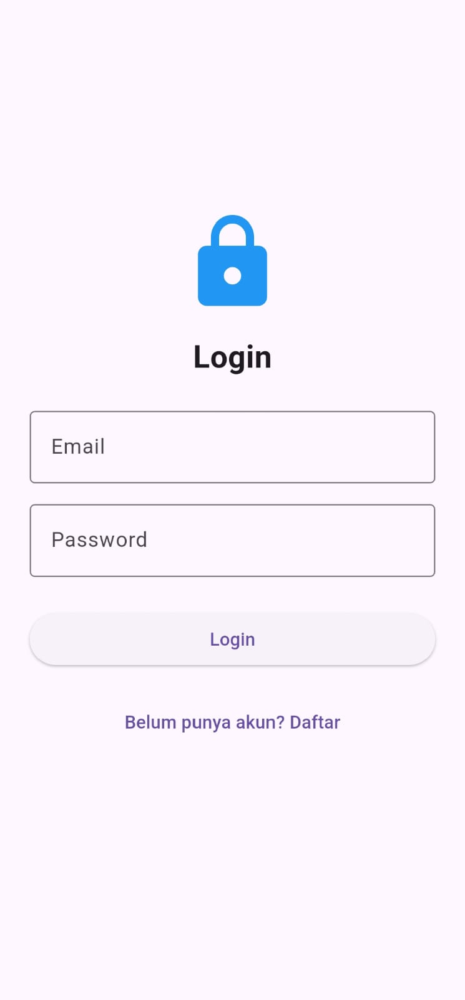
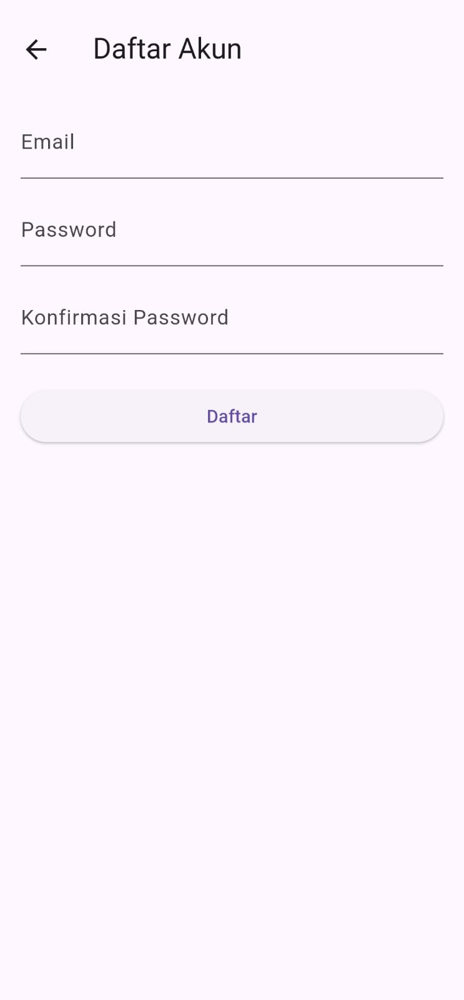
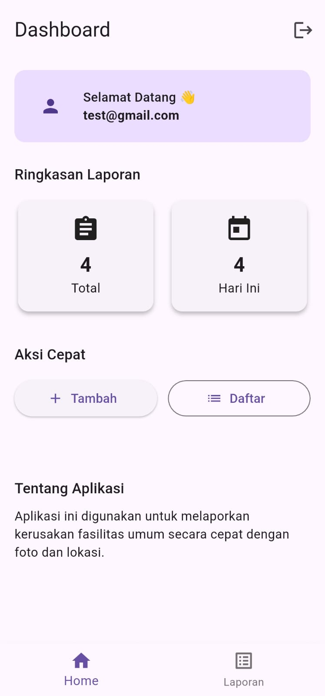
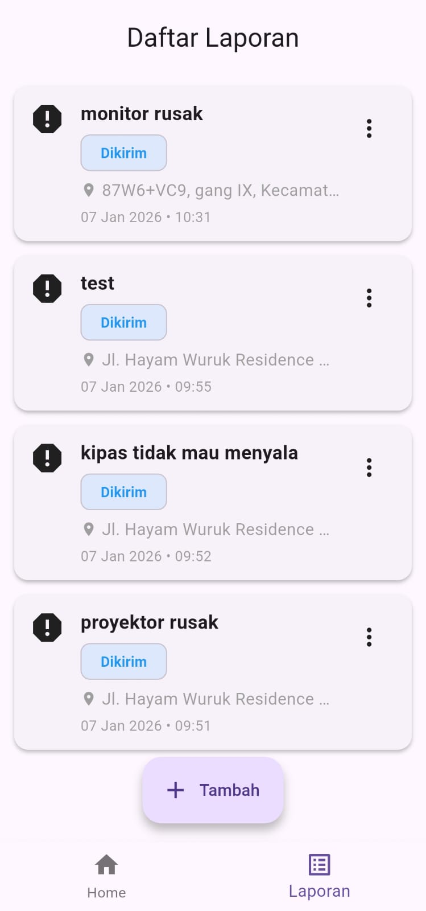
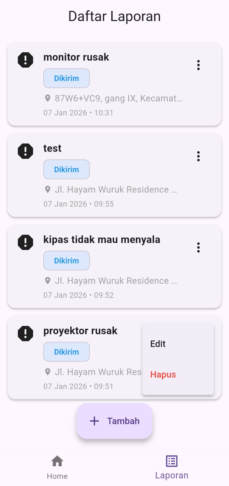
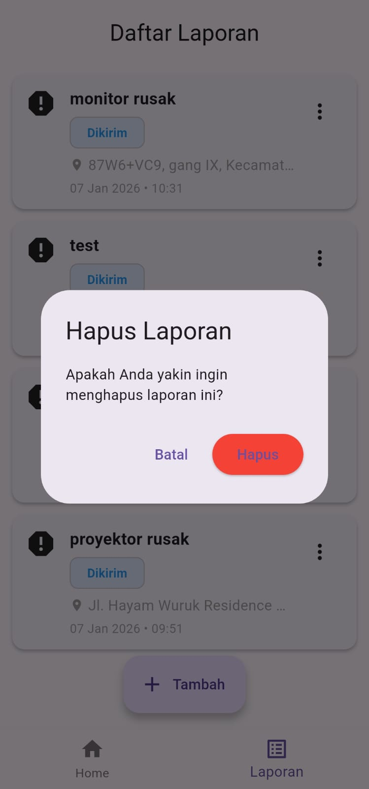
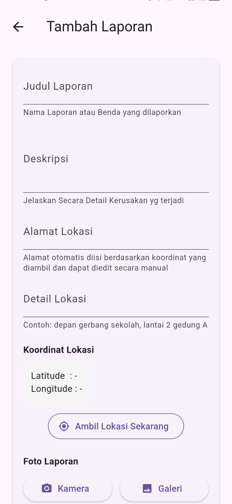
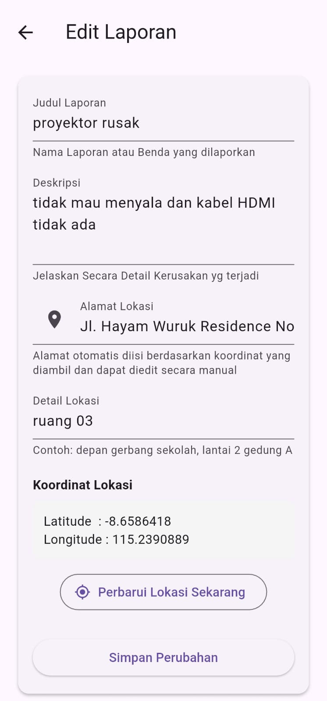
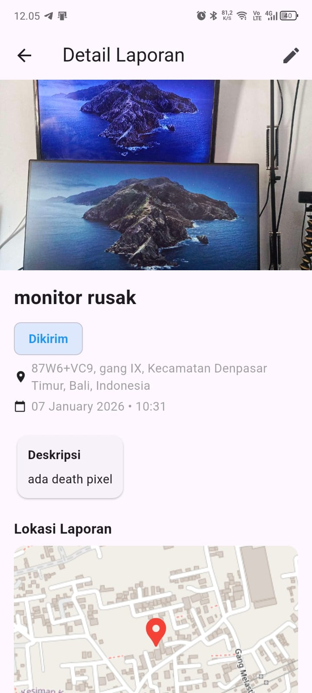

# 📱 Aplikasi Lapor Fasilitas

Aplikasi **Lapor Fasilitas** adalah aplikasi mobile berbasis **Flutter & Firebase** yang digunakan oleh pengguna untuk **melaporkan kerusakan fasilitas umum** secara cepat dan akurat, dilengkapi dengan **foto**, **lokasi GPS**, dan **detail laporan**.

Aplikasi ini dikembangkan sebagai **tugas Ujian Akhir Semester (UAS)** dan saat ini berfokus pada **peran user (pelapor)**.

Create By :
- Komang Dio Aseh Arifianto (2301010053)
- Jaqlien Enjelika Surya (2301010060)
- Ni Made Artya Putri Andini Gunawan (2301010058)

---

## 🎯 Tujuan Aplikasi
- Memudahkan masyarakat melaporkan kerusakan fasilitas umum
- Mengumpulkan laporan berbasis lokasi secara terstruktur
- Menyediakan data laporan yang rapi dan terdokumentasi

---

## 🖼️ Screenshot Aplikasi

### 🔐 Halaman Login

  

### 📝 Halaman Register

  

### 🏠 Halaman Home

  

### 📋 Daftar Laporan

  

### 📋 Daftar Laporan with edit & delete option

  

### 🗑️ Hapus Laporan

  

### ➕ Tambah Laporan

  

### ✏️ Edit Laporan

  

### 🔍 Detail Laporan

  

---

## 🔗 Link Desain & Dokumentasi

### 🎨 Desain UI/UX (Figma)
> **Link Figma:**  
> https://www.figma.com/design/jCuIbd71eY68F1JvjF97ZT/UAS-PM?node-id=1-89&t=J7us8n1zcCBFrtgf-1

---

### 🧩 Dokumentasi UML Aplikasi Lapor Fasilitas
> **Link Softcopy UML:**  
> https://docs.google.com/document/d/1yx90VWVY7nMnnCfDed4U197sqnW0ou6_nJu4zDttr4o/edit?usp=sharing

---

## ✨ Fitur Utama

### 🔐 Autentikasi
- Login & logout menggunakan **Firebase Authentication**
- Setiap laporan terhubung dengan akun user

### 📝 Manajemen Laporan
- Tambah laporan
- Edit laporan
- Lihat daftar laporan
- Lihat detail laporan

### 📍 Lokasi & Alamat
- Mengambil lokasi GPS (latitude & longitude)
- Menampilkan alamat otomatis (reverse geocoding)
- Detail lokasi diisi manual oleh pengguna
- Koordinat ditampilkan secara real-time

### 📸 Foto Laporan
- Ambil foto melalui kamera
- Pilih foto dari galeri
- Foto disimpan secara lokal di perangkat

---

## 🧩 Teknologi yang Digunakan

| Teknologi | Keterangan |
|---------|------------|
| Flutter | Framework utama aplikasi |
| Firebase Authentication | Autentikasi user |
| Cloud Firestore | Penyimpanan data laporan |
| Geolocator | Mengambil koordinat GPS |
| Geocoding | Konversi koordinat ke alamat |
| Image Picker | Mengambil foto |
| Path Provider | Penyimpanan file lokal |

---

## 📊 Alur Penggunaan Aplikasi

1. User login ke aplikasi
2. Masuk ke halaman Home
3. Tambah laporan:
   - Isi judul laporan
   - Isi deskripsi laporan
   - Ambil lokasi GPS
   - Alamat terisi otomatis
   - Detail lokasi diisi manual
   - Tambahkan foto
4. Simpan laporan
5. Laporan dapat diedit kembali jika diperlukan

---

## 🗺️ Pengelolaan Lokasi

- Lokasi diambil menggunakan GPS perangkat
- Alamat diperoleh melalui reverse geocoding
- Pengguna tetap dapat mengedit alamat dan detail lokasi
- Tidak menggunakan Google Maps API (gratis & open-source)
- Preview peta menggunakan OpenStreetMap

---

## ⚠️ Batasan Aplikasi (Scope UAS)

- Aplikasi hanya mendukung role **User**
- Belum tersedia:
  - Role admin/petugas
  - Validasi laporan
  - Notifikasi status laporan
  - Dashboard admin

---

## 🚀 Rencana Pengembangan

- Penambahan role admin/petugas
- Status laporan (Dikirim, Diproses, Selesai)
- Upload foto ke cloud storage
- Notifikasi real-time
- Filter & pencarian laporan

---

## 👨‍🎓 Catatan Akademik

Aplikasi ini dibuat untuk memenuhi kebutuhan **Tugas Ujian Akhir Semester (UAS)** dengan fokus pada:
- Implementasi CRUD
- Request HTTP
- Integrasi Firebase
- Penggunaan Fitur Camera
- Penggunaan GPS & lokasi
- Desain UI/UX yang sederhana dan profesional

---

## 📄 Lisensi

Proyek ini digunakan untuk **keperluan akademik dan pembelajaran**.